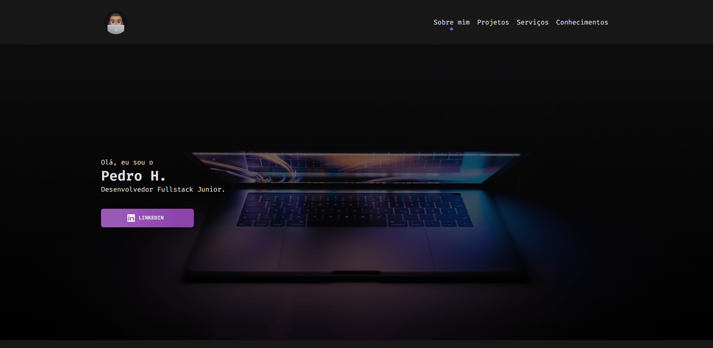

# Personal Portfolio

Portfolio pessoal construido com intuido de fixar o que foi aprendido ate o momento no curso Advanced CSS and SASS:Flexbox,Grid, Animations and More!.

<!--ts-->
   * [Sobre](#sobre)
   * [Instalação](#instalacao)
   * [Seções](#secoes) 
   * [Pré-requisitos](#pre-requisitos) 
   * [Tecnologias](#tecnologias)
   * [Curso](#curso)
   * [Autor](#autor)

<!--te-->

### Instalação

 - [x] Git Clone.
 - [x] npm install.
 - [x] npm run start. 

### Seções

- [x] Destaque
- [x] Sobre mim
- [x] Projetos
- [ ] Conhecimentos
- [ ] Contato
- [ ] Footer

### Pré-requisitos

- [x] Computador
- [x] Browser Atualizado

### 🔧 Tecnologias

As seguintes ferramentas foram usadas na construção do projeto:

- [HTML](https://developer.mozilla.org/pt-BR/docs/Web/HTML)
- [CSS](https://developer.mozilla.org/pt-BR/docs/Web/HTML)
- [SASS](https://sass-lang.com/)

### 💻 Pattern

- [7-1 Pattern Architecture](https://www.learnhowtoprogram.com/user-interfaces/building-layouts-preprocessors/7-1-sass-architecture)

## 🔗 Curso

- [Advanced CSS and SASS](https://www.udemy.com/course/advanced-css-and-sass/)

### 😎 Autor

<a href="https://blog.rocketseat.com.br/author/thiago/">
 
  
 <b>Pedro Henrique</b></a> <a href="https://blog.rocketseat.com.br/author/thiago//" title="Rocketseat">🚀</a>

Feito por Pedro Henrique 👋🏽 Adiciona lá :D

